# BladeOneHtml
It is a PHP library that allows to create forms (view) easily, cleanly and without killing the performance.   It uses the library BladeOne to renders the view. This library only uses a single dependency, one file and nothing more.

This library works in two ways:

* It compiles a script (our view that use our tags), in a native PHP code.
* And the next read, if the script exists, then it uses it (instead of re-compiling). And since the script is native code, then it is exactly like to work in vanilla-php but it is way easy to write and to maintenance.


[](https://packagist.org/packages/eftec/bladeonehtml)
[](https://packagist.org/packages/eftec/bladeonehtml)
[]()
[]()
[]()
[]()
[]()
[]()

[TOC]


## Usage

1. This library requires eftec/bladeone. You could install via Composer in the root folder of your project as

> composer require eftec/bladeonehtml

2. And you should extend the class as follow (BladeOneHtml is a Trait)

```php
include "vendor/autoload.php";

use eftec\bladeone\BladeOne;
use eftec\bladeonehtml\BladeOneHtml;

class myBlade extends  BladeOne {
    use BladeOneHtml;
}

$blade=new myBlade();

// for our example:
$myvalue=@$_REQUEST['myform'];
echo $blade->run("exampleview", ['myvalue'=>$myvalue]);
```

3. Create a folders called  📁 "\views" and 📁 "\compiles"
4. Inside views, creates the next file 📄  "\views\exampleview.blade.php"

```html
<body>
    @form()
        @input(type="text" name="myform" value=$myvalue)
        @button(type="submit" value="Send")
    @endform()
</body>
```

$blade=new myBlade();


## Template basic

This library adds a new set of tags for the template. The tags uses named arguments, so it is easily configurable.

> @&lt;tag&gt;(argument1="value" argument2='value' argument3=value argument4=$variable argument5=function(), argument6="aaa $aaa")

This library uses the native html arguments but some arguments are special

| Argument | Description                                                  | example                                                      |
| -------- | ------------------------------------------------------------ | ------------------------------------------------------------ |
| text     | It adds a content between the tags. **The inner value is always un-quoted.** | @tag(text="hello") -> &lt;tag&gt;hello&lt;/tag&gt;           |
| pre      | It adds a content before the tag                             | @tag(pre="hello") -> hello&lt;tag&gt;&lt;/tag&gt;            |
| post     | It adds a content after the tag                              | @tag(post="hello") -> &lt;tag&gt;&lt;/tag&gt;hello           |
| between  | It adds a content between the tags (it works similar than text) | @tag(between="hello") -> &lt;tag&gt;hello&lt;/tag&gt;        |
| value    | Usually it works as the normal "**value**" of html but it also could works differently (in @textarea works like **text**) | @tag(value="hello") -> < tag value="hello">&lt;/tag&gt;      |
| values   | Some components needs a list of object/arrays.  This argument is used to sets the list of values | @tag(values=$countries)                                      |
| alias    | Some components needs or use a list of object/array. This argument is to reference any row inside the list.  If **values** is set and **alias** is missing, then it creates a new alias called values+"Row". | @tag($values=$countries alias=$country)<br />@tag($values=$countries ) **it asumes  alias=$countriesRow** |
| optgroup | The tag @select could list grouped elements. This argument is used to set the grouping | @tag($values=$countries alias=$country @optgroup=$country->continent) |

Let's say the next example

```
@input(value="hello world" type="text" )
```

It is rendered as

```
<input value="hello world" type="text" />
```

If the tag uses a variable of function, then this view

```
@input(value=$hello type="text" )
```

Is converted into

``` // the
<input value="<?php echo $this->e($hello);?>" type="text" /> 
```

The method $this->e is used to escape the method.

> Note: This library allows any tag, even custom tags (but only if they don't enter in conflict with the special tags, see table)
>
> @input(value="hello world" type="text" mycustomtag="hi" )
>
> Is converted into
````html
<input value="hello world" type="text" mycustomtag="hi" />
````


## Template usage

### input

It shows an input HTML.

Basic example:

```html
@input(id="id1" value="hello world$somevar" type="text" )
```

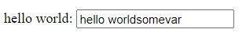


### hidden

It generates a hidden field

Basic example:

```
@hidden(name="id1" value="hello world$somevar" )
```

### label

It shows a label html

```html
@label(for="id1" text="hello world:") 
```


### image

It shows an image

```
@image(src="https://via.placeholder.com/350x150")
```

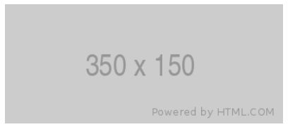

### select

It shows a select (dropdown list) html object

Example:

```
@select(id="aaa" value=$selection values=$countries alias=$country)
    @item(value='aaa' text='hello world')
    @item(value='aaa' text='hello world')
    @item(value='aaa' text='hello world')
    @items( id="chkx" value=$country->id text=$country->name)
@endselect
```

> Note 1: @items requires the arguments values in the parent (@select) and the arguments **value** (the selectable value) and **text** (the visible value)
> Note 2: @items requires an **id**, assigned in the same tag or in the parent tag (in this case, the parent is @select)
> Note 3: By standard, the argument **id** must be unique.

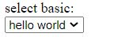

### item

**@item** is an utility tag used inside other tags.  This behave depending on of their parent tag. It adds a simple 
line/row to the parent object.

Example:

```
@select()
    @item(value='aaa' text='hello world')
@endselect

```

It renders

```
<select>
<option value="aaa">hello world</option>
</select>
```

### items

**@items** is a utilitarian tag used inside some tags. This behave depending on of their parent tag. It adds a 
multiples lines/rows to the parent object using the tag **values**

> Note: This tag requires some arguments:
>
> * the parent(or this tag) requires the tag **values** 
> * the parent requires the tag **value** It indicates the current selection (if any)
> * the parent(or this tag) requires the tag **alias** If alias is missing the it uses the name of values + "Row", i.e. values=product -> alias= productRow
> * the parent(or this tag) requires the tag **id**  
>   * The rendered "id" will be generated using this id+"_"+"id of the row". i.e. id="idproduct" => idproduct_0, idproduct_1
>   * Why?  It is because the id must be unique (html specs)

Example, if $countries is a list of objects then :

```
@select(id="aaa" value=$selection values=$countries alias=$country)
    @items( id="chkx" value=$country->id text=$country->name)
@endselect
```

If $countries is a list of arrays then:

```
@select(id="aaa" value=$selection values=$countries alias=$country)
    @items( id="chkx" value=$country['id'] text=$country['name'])
@endselect
```


Inside the tag items, you could use the next variables

| variable (where values is the variable used)             | Specification                                                |
| -------------------------------------------------------- | ------------------------------------------------------------ |
| **$values**OptGroup                                      | It stores the current optgroup (if any). Example: $productOptGroup |
| **$values**Key                                           | It indicates the current key of the current row. Example: $productKey |
| $alias (if not alias is set then it uses **$values**Row) | The current row of the variable. Example: $productRow        |

### optgroup

It starts an optional group (select)

Example:

```
@select(id="aaa" value=$selection values=$countries alias=$country)
    @optgroup(label="group1")
        @item(value='aaa' text='hello world')
        @item(value='aaa' text='hello world')
        @item(value='aaa' text='hello world')
    @endoptgroup
@endselect
```

> Note: this tag must be ended with the tag @endoptgroup

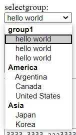

### checkbox

It adds a  single checkbox

Example:

```
@checkbox(id="idsimple" value="1" checked="1" post="it is a selection")
```

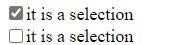

### radio

It adds a single radio button

Example:

```
@radio(id="idsimple" value="1" checked="1" post="it is a selection")
```

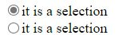

### textarea

It draws a text area.

Example:

```
@textarea(id="aaa" value="3333 3333 aaa3333 ")
```

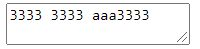

### button

It draws a button

Example:

```
@button(value="click me" type="submit" class="test" onclick='alert("ok")')
```

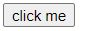

### link

It adds an hyperlink

Example:

```
@link(href="https://www.google.cl" text="context")
```

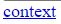

### checkboxes

It shows a list of checkboxes

```
@checkboxes(id="checkbox1" value=$selection alias=$country)
    @item(id="aa1" value='aaa' text='hello world' post="<br>")
    @item(id="aa2" value='aaa' text='hello world2' post="<br>")
    @items(values=$countries value='id' text='name' post="<br>")
@endcheckboxes
```


### radios

It shows a list of radio buttons

```
@radios(id="radios1" name="aaa" value=$selection  alias=$country)
    @item(value='aaa' text='hello world' post="<br>")
    @item(value='aaa' text='hello world2' post="<br>")
    @items(values=$countries value='id' text='name' post="<br>")
@endradios
```


### file

It generates a file input value

```
@file(name="file" value="123.jpg" post="hello world")
```

> Note: it also renders a hidden file with name "name"+"_file" with the original value

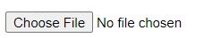

### ul

It generates an unsorted list

```
@ul(id="aaa" value=$selection values=$countries alias=$country)
    @item(value='aaa' text='hello world')
    @item(value='aaa' text='hello world')
    @item(value='aaa' text='hello world')
    @items(value=$country->id text=$country->name)
@endul
```

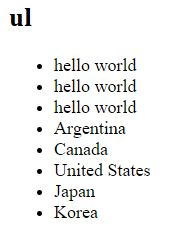

### ol

It generates a sorted list

```
@ol(id="aaa" value=$selection values=$countries alias=$country)
    @item(value='aaa' text='hello world')
    @item(value='aaa' text='hello world')
    @item(value='aaa' text='hello world')
    @items(value=$country->id text=$country->name)
@endol
```

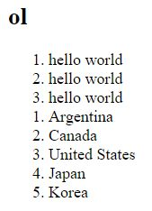

### pagination

It generates a pagination. It requires bootstrap3, bootstrap4 or bootstrap5.  

You can find an example at [examples/examplepagination.php](examples/examplepagination.php)

PHP code

```php
$current=isset($_GET['_page']) ? $_GET['_page'] : 1;
echo $blade->run("examplepagination", 
    ['totalpages'=>count($products)
     ,'current'=>$current
     ,'pagesize'=>10
     ,'products'=>$items
    ]);
```

Template

```html
@pagination(numpages=$totalpages current=$current  pagesize=$pagesize urlparam='_page')
```

> Note: The page is base 1.
> Note: the argument urlparam is used to build the link (domain.dom/web.php?_page=999)

You can change the name of the buttons **prev** and **next** as follow:

```php
$this->setTranslation(['pagination'=>['prev'=>'<&lt;>','next'=>'&gt;']]);
```

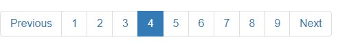  

### table

It renders a table

```
@table(class="table" values=$countries alias=$country border="1")
    @tablehead  
        @cell(text="id")
        @cell(text="cod")
        @cell(text="name")
    @endtablehead
    @tablebody(id='hello world'  )
        @tablerows(style="background-color:azure")
            @cell(text=$country->id style="background-color:orange")
            @cell(text=$country->cod )
            @cell(text=$country->name)
        @endtablerows
    @endtablebody
    @tablefooter
        @cell(text="id" colspan="3")
    @endtablefooter
@endtable
```


#### tablehead

It renders the header of the table (optional). Each cell added inside it, is rendered as "th" HTML tag

#### tablebody

It renders the body of the table (optional). Each cells added inside it, is rendered as "td" HTML tag

#### tablefooter

It renders the footer of the table (optional). Each cell added inside it, is rendered as "th" HTML tag

#### tablerows

It generates a row inside the body

#### cells

It renders a cell inside the tablehead,tablebody (tablerows) or tablefooter

### cssbox

It render and css added into the box

```html
<head>   
	@cssbox
</head>
```

#### How to add a new css into the cssbox?

Using the method addCss($css,$name)

```php
$this->addCss('<link rel="stylesheet" href="mystyle.css">','mystyle'); 
$this->addCss('css/stylename.css'); 
```

**$css** could be a link or a link tag

**$name** is optional but it avoids to add duplicates. If we add a new CSS with the same name than a previous one, then it is ignored.

### jsbox

It renders all JavaScript links added to the box

```html
<body>
    <!-- our page -->
	@jsbox
</body>
```

#### How to add a new JavaScript into the cssbox?

Using the method addJs($script,$name)

```php
$this->addJs('<script src="js/jquery.js"></script>','jquery');
```

### jscodebox

```html
<body>
    <!-- our page -->
    @jsbox <!-- we could load jquery here -->
	@jscodebox(ready)
</body>
```

This code adds the tags < script > automatically.

The argument **ready** indicates if we want to execute the function when the document is ready.

How to add a new JavaScript code into the **jscodebox**?

```php
$blade->addJsCode('alert("hello");');
```


## Template Customization

**BladeOneHtml** allows to modify the tags used and to set a default classes for each class.

You can set a default class and tags for Bootstrap 3/4/5 using the next method (pick only one).

```php
// if true then it loads the css and js from a cdn into the css and jsbox so it requires @cssbox and @jsbox
$blade->useBootstrap5(true); 
// if true then it loads the css and js from a cdn into the css and jsbox so it requires @cssbox and @jsbox
$blade->useBootstrap4(true); 
// if true then it loads the css and js from a cdn into the css and jsbox so it requires @cssbox and @jsbox
$blade->useBootstrap3(true); 
```


Or you could create your own tags and classes

### Set a default class

```php
$blade->defaultClass[$tagname]='default class';
```

### Set a custom pattern

```php
$blade->pattern['nametag']='pattern';
```

Where nametag could be as follow

| Name          | Description                                                  | Example     | Code                                                 |
| ------------- | ------------------------------------------------------------ | ----------- | ---------------------------------------------------- |
| nametag       | It uses the pattern to use when the tag is used              | input       | {{pre}}<input{{inner}} >{{between}}< /input>{{post}} |
| nametag_empty | The system uses this pattern if the content (between/text) is empty or not set (a self close tag). If not set, then the system uses **nametag**  even if the content is empty | input_empty | {{pre}}< input{{inner}} />{{post}}                   |
| nametag_item  | The system uses this pattern for tags @item and @items       | select_item | < option{{inner}} >{{between}}< /option>             |
| nametag_end   | It uses this pattern when the tag must be closed             | form_end    | < /form>                                             |

#### Pattern-Variables inside the code

| variable    | explanation                                                  | Escaped (*)                                                  |
| ----------- | ------------------------------------------------------------ | ------------------------------------------------------------ |
| {{pre}}     | The code before the tag : **pre** &lt;tag  >&lt;/tag&gt;     | no                                                           |
| {{post}}    | The code after the tag : < tag  >&lt;/tag&gt; **post**       | no                                                           |
| {{inner}}   | The attributes inside the tag : < tag **inside** > &lt;/tag&gt; | yes                                                          |
| {{between}} | The content between the tag : < tag >**between**&lt;/tag>    | By default this value is escaped <br />but it could be un-escaped |
| {{id}}      | The id attribute (it is also included in {{inner}}): < tag **id** > &lt;/tag&gt; | yes                                                          |
| {{name}}    | The name attribute (it is also included in {{inner}}): < tag **name** > &lt;/tag&gt; | yes                                                          |

Example of a normal tag:

```php
$blade->pattern['input']='{{pre}}<input{{inner}} >{{between}}</input>{{post}}';
```

> Note :(*) What is escaped?. For example the text "<hello world>", if it escaped, it is displayed as "&amp;lt;hello&amp;gt;"

#### Custom attribute

It is possible to add a custom attribute that it could be used inside a pattern.

For example, let's add the custom tag called **customtag**

```php
$blade->customAttr['customtag']='This attr is missing!'; 
$blade->pattern['alert']='{{pre}}<div {{inner}}><h1>{{customtag}}</h1>{{between}}</div>{{post}}';
```

And in the view

```html
@alert(text="hi there" class="alert-danger" customtag="it is a custom tag")<br>
@alert(text="hi there" class="alert-danger" )<br>
```

## Methods

The library has a lit of methods that they could be used to initialize and configure the library. They are optionals.

### useBootstrap5

It sets the patterns and classes to be compatible with bootstrap 4. 

if argument is true, then it adds the CSS to the **css box** from the CDN   

Our code

```php
$blade->useBootstrap5(true); 
```

#### Note: If we want to use the css box, then we need to add to our view the next code

```html
<header>
	@cssbox
</header>
```


### useBootstrap4

It sets the patterns and classes to be compatible with bootstrap 4. 

if argument is true, then it adds the CSS to the **css box** from the CDN   

Our code

```php
$blade->useBootstrap4(true); 
```

#### Note: If we want to use the css box, then we need to add to our view the next code

```html
<header>
	@cssbox
</header>
```


### useBootstrap3

It sets the patterns and classes to be compatible with bootstrap 3. 

if argument is true, then it adds the CSS to the **css box** from the CDN   

```php
$blade->useBootstrap3(true); 
```

### addCss

It adds a CSS to the **css box**

```php
$this->addCss('css/datepicker.css','datepicker'); 
```

### addJS

It adds a javascript link to the **js box**

```php
$this->addJs('<script src="js/jquery.js"></script>','jquery');
```

### addJSCode

It adds a a javascript code to the **js box**

```php
$blade->addJsCode('alert("hello");');
```


## Public Fields

It is the list of public fields of the class. The fields are public because for performance purpose (versus to use setter and getters)

### $pattern

It stores the list of patterns used by the code

```php
$this->pattern['sometag']='{{pre}}<tag {{inner}}>{{between}}</tag>{{post}}';

```

> Note: see "Pattern-Variable inside the code" to see the list of pattern-variables

### $defaultClass

The default CSS class added to a specific tag.

```php
$this->defaultClass['sometag']='classred classbackgroundblue';
```

### $customAttr

It adds a custom adds that it could be used together with $this->pattern

```php
$this->customAttr['customtag']='XXXXX'; // So we could use the tag {{customtag}}. 'XXXXX' is the default value
```

> The custom attribute always removes the quotes and double quotes, so if our value is "hello" -> hello

## Creating a new pattern

It is possible to add a new pattern by extending the PHP class.

#### 1- Adding a new pattern

```
$this->pattern['mynewtag']='<mycustomtag {{inner}}>{{between}}</mycustomtag>';
```

#### 2- Creating a new method

You could create a new PHP class or trait and extend our class. Inside this new structure, you must add a new method with the next structure

Using a new class

```php
use eftec\bladeone\BladeOne;
use eftec\bladeonehtml\BladeOneHtml;

class MyBlade extends  BladeOne {
    use BladeOneHtml;
}
class MyClass extends MyBlade {
    protected function compileMyNewTag($expression) { // the method must be called "compile" + your name of tag.
        $args = $this->getArgs($expression); // it separates the values of the tags
        $result = ['', '', '', '']; // inner, between, pre, post
        // your custom code here
        return $this->render($args, 'mynewtag', $result); // we should indicate to use our pattern.
    }
}
```

Using a trait (recommended, why? It is because trait are more flexible)

```php
trait MyTrait {
    protected function compileMyNewTag($expression) { // the method must be called "compile" + your name of tag.
        $args = $this->getArgs($expression); // it separates the values of the tags
        $result = ['', '', '', '']; // inner, between, pre, post
        // your custom code here
        return $this->render($args, 'mynewtag', $result); // we should indicate to use our pattern.
    }
}

class MyClass extends  BladeOne {
    use BladeOneHtml;
    use MyTrait; // <-- our trait
}
```


#### 3- Creating a new parent Method (container method)

For creating a parent method, you must push a new value inside $this->htmlItem. You can store whatever you want to.

```php
$this->pattern['mynewtag']='<mycustomtag {{inner}}>{{between}}';
```

```php
protected function compileMyNewTag($expression) {
	$args = $this->getArgs($expression); // it loads and separates the arguments.
    $this->htmlItem[] = ['type' => 'mynewtag','value' => @$args['value']
    ];
    $result = ['', '', '', '']; // inner, between, pre, post
    //unset($args['value']); // we could unset values that we don't want to be rendered.
    return $this->render($args, 'select', $result);
}

```

> Our objective is to render PHP code, not to evaluate a code. For example, if $args['somearg']=$variable, then our value is $variable (as text), no matter the real value of the variable.

You must also create a method to end the container and we must also add a new pattern.

```php
$this->pattern['mynewtag_end']='</mycustomtag>';
```

```php
protected function compileEndNewTag() {
    $parent = @\array_pop($this->htmlItem); // remove the element from the stack
    if (\is_null($parent) || $parent['type']!=='newtag') { // if no element in the stack or it's a wrong one then error
        $this->showError("@endnewtag", "Missing @initial tag", true);
    }
    // our code
    return $this->pattern[$parent['type'] . '_end']; // renders the element of the stack
}
```

Our items could know if they are inside a tag with the next operation

```php
$parent = \end($this->htmlItem);
```

#### 4- Advanced 

We could create a component that requires CSS and JavaScript.

For example a date picker.

```php
protected function compileDatePicker($expression) {
	$args = $this->getArgs($expression); // it loads and separates the arguments.
    \array_push($this->htmlItem, ['type' => 'mynewtag','value' => @$args['value']]);
    $result = ['', '', '', '']; // inner, between, pre, post
    if(!isset($args['id'])) {
        $this->showError("@datepicker", "Missing @id tag", true);
    }    
    $this->addJs('<script src="js/jquery.js"></script>','jquery'); // our script needs jquery (if it is not loaded)
    $this->addCss('css/datepicker.css','datepicker'); 
    $this->addjscode('$(.'.$args['id'].').datepicker();');
    
    //unset($args['value']); // we could unset values that we don't want to be rendered.
    return $this->render($args, 'select', $result);
}
```

>  Note: It's better to add the library of jQuery and date picker once in our code


## Version history
* 2.3 2022-02-04
  * Now this library is compatible with PHP 7.2 and higher.
  * Some cleanups and type hinting (return methods)
* 2.2 2021-12-11
  * fixed a problem with optgroup and when the argument is an associative array. 
* 2.1 2021-10-01
  * Added support for Bootstrap 5.0
  * Updated Bootstrap CDNs
  * added tags @container, @row, @col
* 2.0 2021-09-24
  * Dropped support for PHP 5.x. Updated support for BladeOne 4.0  
* 1.8.1 2021/07/03
  * It solves a problem when the argument is defined as id="somevalue$id"  
* 1.8 2021/06/09 
   * @checkbox and @radio now works with variables. The element is checked only if the value is not null, empty or zero.
* 1.7.1 2021/02/06
    * @item now marks the value "checked" or "selected" if the values is equals to the current value of the parent object
    * Bootstrap 4 **CDN** now it uses the version 4.6    
    * for @item and @items, the field name and **idname** are created automatically. If id is set, then it uses it.
* 1.7 2021/01/12
    * @button now considers value as the value of argument while text the visual content.  
    * It also uses in_array instead of isset().
    * Compatible with PHP 8.x
* 1.6.1 2020/08/31    
    * Pagination now it has "first" and "last" buttons.
* 1.6 2020/08/30   
    * Added tag @pagination       
    * Added the method setTranslationControl() and getTranslationControl()      
* 1.5 2020/06/07
    * Added a new optional argument to processArgs() and render();
    * Added unit test.
* 1.4 2020/05/02
    * now it allows empty arguments. It requires BladeOne 3.43 or higher.  
    * added unit test.
* 1.3 2020/04/22
    * added method useBootstrap3()
    * added default class for textarea in useBootstrap4()
* 1.2 2020/04/21  
    * tag @@alert()  
    * fixed: @@items() now it keeps the selection   
    * tag @@cssbox, @@jsbox and @jscodebox
    * method useBootstrap4($cdn=false) has a new argument
* 1.1 2020/04/21 
    * Method isVariablePHP() moved to BladeOne
    * Update LICENSE.
    * Added more documentation.    
* 1.0 2020-04-20 First version

