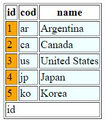

# BladeOneHtml
It is a PHP library that allows to create forms (view) easily, cleanly and without killing the performance.   It uses the library BladeOne to renders the view. This library only uses a single dependency, one file and nothing more.

This library works in two ways:

* It compiles a script (our view that use our tags), in a native php code.
* And the next read, if the script exists, then it uses it (instead of re-compiling). And since the script is native code, then it is exactly like to work in vanilla-php but it is way easy to write and to maintenance.


[](https://packagist.org/packages/eftec/bladeonehtml)
[](https://packagist.org/packages/eftec/bladeonehtml)
[]()
[]()
[]()
[]()
[]()

## Usage

1. This library requires eftec/bladeone. You could install via Composer in the root folder of your project as

> composer require eftec/bladeonehtml

2. And you should extend the class as follow (BladeOneHtml is a Trait)

```php
include "vendor/autoload.php";

use eftec\bladeone\BladeOne;
use eftec\bladeonehtml\BladeOneHtml;

class myBlade extends  BladeOne {
    use BladeOneHtml;
}

$blade=new myBlade();

// for our example:
$myvalue=@$_REQUEST['myform'];
echo $blade->run("exampleview", ['myvalue'=>$myvalue]);
```

3. Create a folders called  📁 "\views" and 📁 "\compiles"
4. Inside views, creates the next file 📄  "\views\exampleview.blade.php"

```
<body>
    @form()
        @input(type="text" name="myform" value=$myvalue)
        @button(type="submit" value="Send")
    @endform()
</body>
```

$blade=new myBlade();


## Template basic

This library adds a new set of tags for the template. The tags uses named arguments, so it is easily configurable.

> @<tag>(argument1="value" argument2='value' argument3=value argument4=$variable argument5=function(), argument6="aaa $aaa")

This library uses the native html arguments but some arguments are special

| Argument | Description                                                  | example                                                      |
| -------- | ------------------------------------------------------------ | ------------------------------------------------------------ |
| text     | It adds a content between the tags. **The inner value is always un-quoted.** | @tag(text="hello") -> < tag>hello< /tag>                     |
| pre      | It adds a content before the tag                             | @tag(pre="hello") -> hello< tag>< /tag>                      |
| post     | It adds a content after the tag                              | @tag(post="hello") -> < tag>< /tag>hello                     |
| between  | It adds a content between the tags (it works similar than text) | @tag(between="hello") -> < tag>hello< /tag>                  |
| value    | Usually it works as the normal "**value**" of html but it also could works differently (in @textarea works like **text**) | @tag(value="hello") -> < tag value="hello">< /tag>           |
| values   | Some components needs a list of object/arrays.  This argument is used to sets the list of values | @tag(values=$countries)                                      |
| alias    | Some components needs or use a list of object/array. This argument is to reference any row inside the list.  If **values** is set and **alias** is missing, then it creates a new alias called values+"Row". | @tag($values=$countries alias=$country)<br />@tag($values=$countries ) **it asumes  alias=$countriesRow** |
| optgroup | The tag @select could list grouped elements. This argument is used to set the grouping | @tag($values=$countries alias=$country @optgroup=$country->continent) |

Let's say the next example

```
@input(value="hello world" type="text" )
```

It is rendered as

```
<input value="hello world" type="text" />
```

If the tag uses a variable of function, then this view

```
@input(value=$hello type="text" )
```

Is converted into

``` // the
<input value="<?php echo $this->e($hello);?>" type="text" /> 
```

The method $this->e is used to escape the method.

> Note: This library allows any tag, even custom tags (but only if they don't enter in conflict with the special tags, see table)
>
> @input(value="hello world" type="text" mycustomtag="hi" )
>
> Is converted into
>
> <input value="hello world" type="text" mycustomtag="hi" />


## Template usage

### input

It shows a input html.

Basic example:

```
@input(id="id1" value="hello world$somevar" type="text" )
```


### label

It shows a label html

```
@label(for="id1" text="hello world:") 
```


### image

It shows an image

```
@image(src="https://via.placeholder.com/350x150")
```


### select

It shows a select (dropdown list) html object

Example:

```
@select(id="aaa" value=$selection values=$countries alias=$country)
    @item(value='aaa' text='hello world')
    @item(value='aaa' text='hello world')
    @item(value='aaa' text='hello world')
    @items( id="chkx" value=$country->id text=$country->name)
@endselect
```

> Note: items requires to set arguments


### item

It is an utilitarian tag used inside some tags.  This behave depending of their parent tag. It adds a simple line/row to the parent object.

Example:

```
@select()
    @item(value='aaa' text='hello world')
@endselect

```

It renders

```
<select>
<option value="aaa">hello world</option>
</select>
```

### items

It is an utilitarian tag used inside some tags. This behave depending of their parent tag. It adds a multiples lines/rows to the parent object using the tag **values**

> Note: This tag requires some arguments:
>
> * the parent(or this tag) requires the tag **values** 
> * the parent requires the tag **value** It indicates the current selection (if any)
> * the parent(or this tag) requires the tag **alias** If alias is missing the it uses the name of values + "Row", i.e. values=product -> alias= productRow
> * the parent(or this tag) requires the tag **id**  
>   * The rendered "id" will be generated using this id+"_"+"id of the row". i.e. id="idproduct" => idproduct_0, idproduct_1
>   * Why?  It is because the id must be unique (html specs)

Example, if $countries is a list of objects then :

```
@select(id="aaa" value=$selection values=$countries alias=$country)
    @items( id="chkx" value=$country->id text=$country->name)
@endselect
```

If $countries is a list of arrays then:

```
@select(id="aaa" value=$selection values=$countries alias=$country)
    @items( id="chkx" value=$country['id'] text=$country['name'])
@endselect
```


Inside the tag items, you could use the next variables

| variable (where values is the variable used)             | Specification                                                |
| -------------------------------------------------------- | ------------------------------------------------------------ |
| **$values**OptGroup                                      | It stores the current optgroup (if any). Example: $productOptGroup |
| **$values**Key                                           | It indicates the current key of the current row. Example: $productKey |
| $alias (if not alias is set then it uses **$values**Row) | The current row of the variable. Example: $productRow        |

### optgroup

It starts an optional group (select)

Example:

```
@select(id="aaa" value=$selection values=$countries alias=$country)
    @optgroup(label="group1")
        @item(value='aaa' text='hello world')
        @item(value='aaa' text='hello world')
        @item(value='aaa' text='hello world')
    @endoptgroup
@endselect
```

> Note: this tag must be ended with the tag @endoptgroup


### checkbox

It adds a  single checkbox

Example:

```
@checkbox(id="idsimple" value="1" checked="1" post="it is a selection")
```


### radio

It adds a single radio button

Example:

```
@radio(id="idsimple" value="1" checked="1" post="it is a selection")
```


### textarea

It draws a text area.

Example:

```
@textarea(id="aaa" value="3333 3333 aaa3333 ")
```


### button

It draws a button

Example:

```
@button(value="click me" type="submit" class="test" onclick='alert("ok")')
```


### link

It adds an hyperlink

Example:

```
@link(href="https://www.google.cl" text="context")
```


### checkboxes

It shows a list of checkboxes

```
@checkboxes(id="checkbox1" value=$selection alias=$country)
    @item(id="aa1" value='aaa' text='hello world' post="<br>")
    @item(id="aa2" value='aaa' text='hello world2' post="<br>")
    @items(values=$countries value='id' text='name' post="<br>")
@endcheckboxes
```


### radios

It shows a list of radio buttons

```
@radios(id="radios1" name="aaa" value=$selection  alias=$country)
    @item(value='aaa' text='hello world' post="<br>")
    @item(value='aaa' text='hello world2' post="<br>")
    @items(values=$countries value='id' text='name' post="<br>")
@endradios
```


### file

It generates a file input value

```
@file(name="file" value="123.jpg" post="hello world")
```

> Note: it also renders a hidden file with name "name"+"_file" with the original value


### ul

It generates an unsorted list

```
@ul(id="aaa" value=$selection values=$countries alias=$country)
    @item(value='aaa' text='hello world')
    @item(value='aaa' text='hello world')
    @item(value='aaa' text='hello world')
    @items(value=$country->id text=$country->name)
@endul
```


### ol

It generates a sorted list

```
@ol(id="aaa" value=$selection values=$countries alias=$country)
    @item(value='aaa' text='hello world')
    @item(value='aaa' text='hello world')
    @item(value='aaa' text='hello world')
    @items(value=$country->id text=$country->name)
@endol
```


### table

It renders a table

```
@table(class="table" values=$countries alias=$country border="1")
    @tablehead  
        @cell(text="id")
        @cell(text="cod")
        @cell(text="name")
    @endtablehead
    @tablebody(id='hello world'  )
        @tablerows(style="background-color:azure")
            @cell(text=$country->id style="background-color:orange")
            @cell(text=$country->cod )
            @cell(text=$country->name)
        @endtablerows
    @endtablebody
    @tablefooter
        @cell(text="id" colspan="3")
    @endtablefooter
@endtable
```



#### tablehead

It renders the header of the table (optional). Each cell added inside it, is rendered as "th" html tag

#### tablebody

It renders the body of the table (optional). Each cells added inside it, is rendered as "td" html tag

#### tablefooter

It renders the footer of the table (optional). Each cell added inside it, is rendered as "th" html tag

#### tablerows

It generates a row inside the body

#### cells

It renders a cell inside the tablehead,tablebody (tablerows) or tablefooter

## Version history

1.0 2020-04-20 First version

